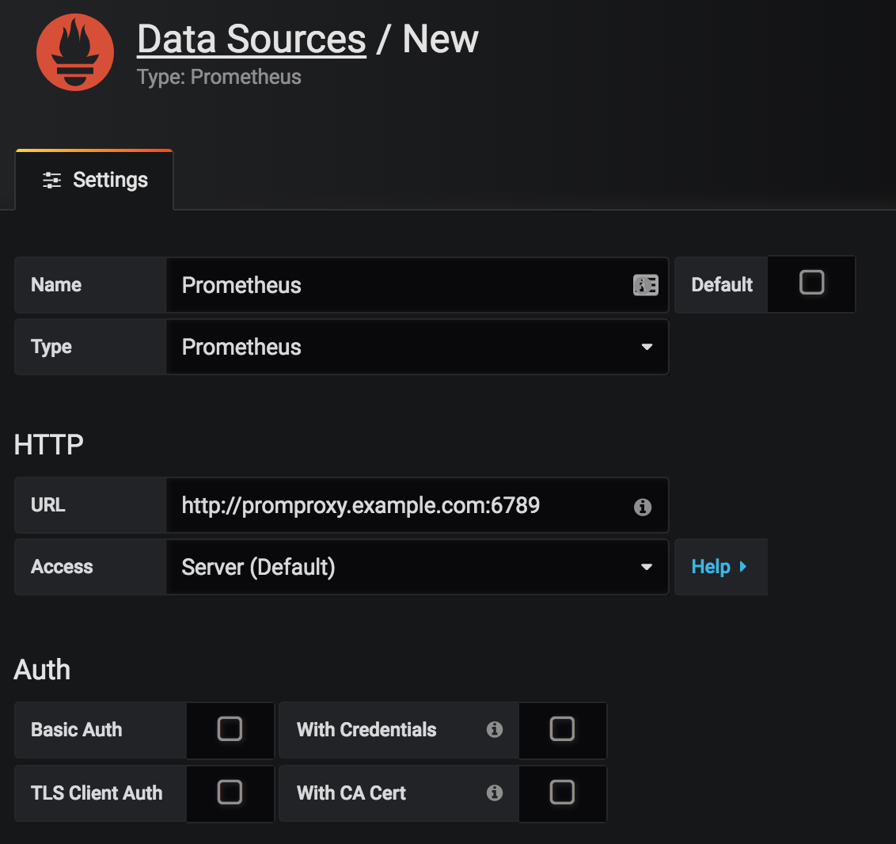

# PromProxy

A daemon that receives Prometheus API calls from a system such as Grafana, sends that request to multiple Prometheus instances, and aggregates the responses.

Systems like Grafana don't work well when your data is split up across multiple non overlapping Prometheus servers. This daemon attempts to trick the requester into thinking that there is just one server, but the requests to go many.

# Getting started

## Building

Before starting, you should have [installed go](https://golang.org/doc/install) and ensure that your [`$GOPATH`](https://github.com/golang/go/wiki/SettingGOPATH) environment variable is also set.

### Get the source code

```
$ go get https://github.com/swalberg/promproxy
```

### Build the app

```
$ cd $GOPATH/src/github.com/swalberg/promproxy
$ make
```

Upon success, you will have the binary named `app` in your current directory

## Running

### Launching

At this time, there are limited configuration options, so running the app is simple.

Launch it with an array of Prometheus servers as arguments

```
$ ./app http://192.168.0.20:9090 http://192.168.0.30:9090 http://192.168.0.40:9090
```

### Testing

Once running, the app will be listening at `http://0.0.0.0:6379`

Perform a test query against the `label` endpoint

```
$ curl http://localhost:6789/api/v1/label/job/values
{"status":"success","data":["prometheus"]}
```
### Grafana

After promproxy is running, setup (or change) your `Prometheus` data source in Grafana to point to promproxy instead of a prometheus server.



## API Limitations

Currently, only the following endpoints of the Prometheus API are supported:

- label
- series
- query_range

These endpoints should provide sufficient functionality for building dashboards in [Grafana](https://grafana.com/)